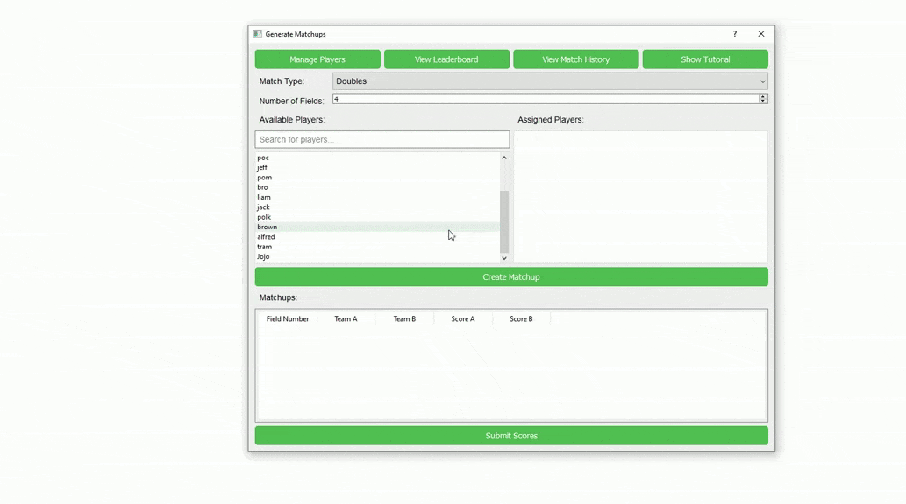
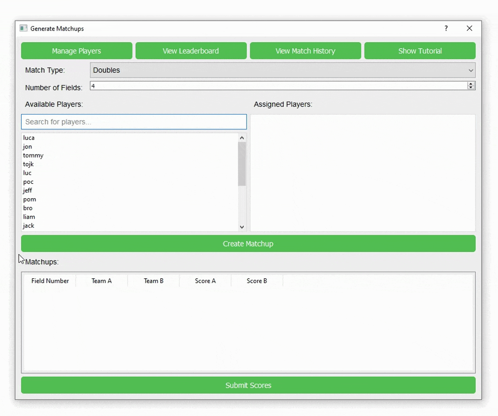
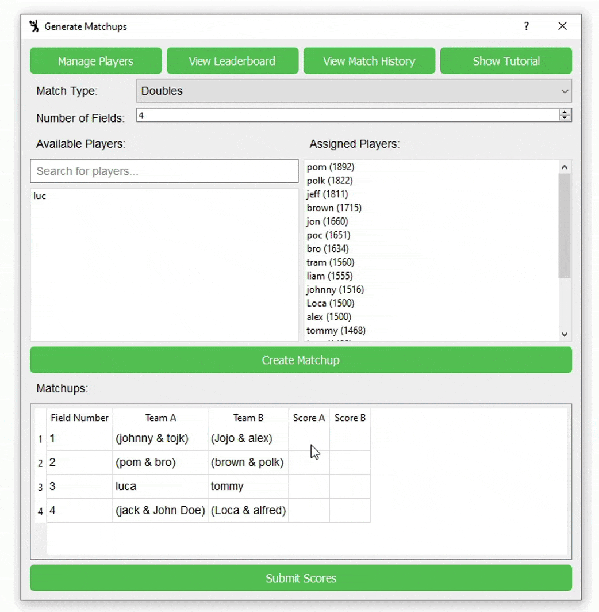

## How to Use Match Generator

### Manage Players
* In the Manage Players menu, add players' names and an estimation of their ELO Rating compared to the other players in your league.

### Schedule Matches
1. Create matchups by drag and dropping available players into the assigned players section.
2. Specify Singles or Doubles and the number of fields.
3. Click 'Create Matchup' to generate games.

### Submit Scores
* Enter match results and click on the 'Submit Scores' button.

